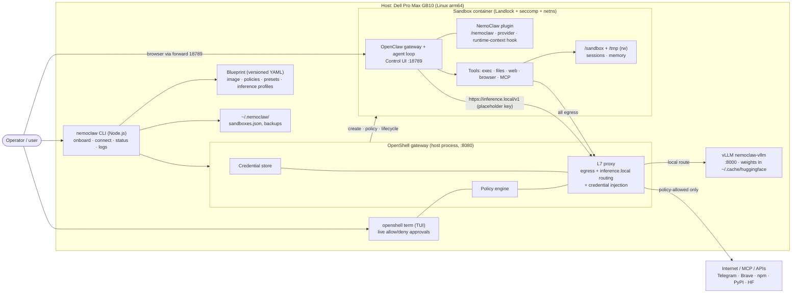
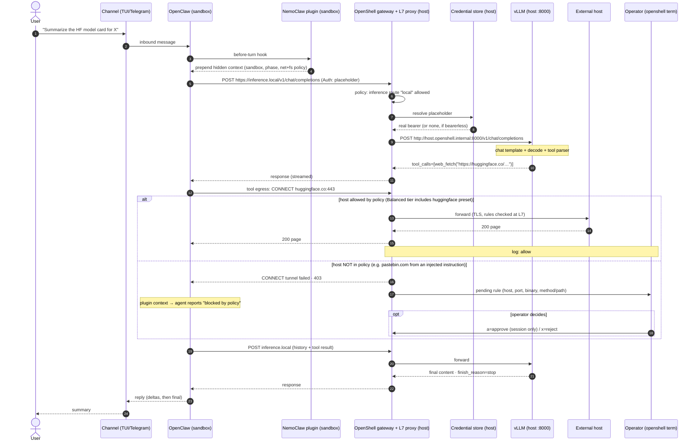
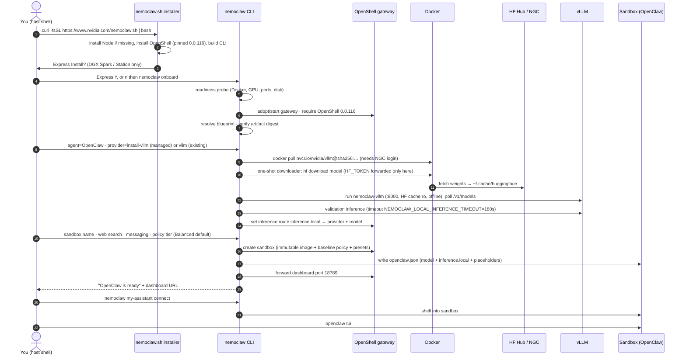

# 01 · Stack architecture

*The entity table from [00](00-agents-101.md), with product names filled in — plus the one surprise:
**the agent never talks to the model server directly, and never holds a real key.** Both inference and every
tool's egress cross the same L7 proxy, which is where policy and credentials live.*

Sources: `docs-raw/Agent onboarding … GB10.md` Parts 2A–2C; `docs-raw/01-Getting-Started.md`.

## 30-second version

| Layer | Product | One line |
|---|---|---|
| The loop (hands) | **OpenClaw** | Agent runtime: loop, tools, skills, memory, channels, TUI/Web UI |
| The cage (walls) | **OpenShell** | Sandbox (Landlock + seccomp + netns) **+** L7 gateway proxy + policy + credential store |
| The installer (IT dept) | **NemoClaw** | Host CLI + versioned blueprint + in-sandbox plugin; `nemoclaw onboard` wires it all |
| The engine (known) | **vLLM** | Serves the model on the host `:8000` — template, decode, tool-call parsing, OpenAI API |

OpenShell is general-purpose (sandbox *any* agent). OpenClaw is just an agent. **Neither knows about the other** — NemoClaw glues them together.

## Who implements each entity, and where it runs

| Entity (from 00) | Concrete component | Runs where | Handle you'll touch |
|---|---|---|---|
| Channel | OpenClaw Control UI, TUI, Telegram/Slack/Discord | Sandbox; UI forwarded to host `127.0.0.1:18789` | `nemoclaw <n> dashboard-url --quiet`, `openclaw tui` |
| Agent runtime | OpenClaw loop + NemoClaw OpenClaw plugin | Sandbox | `nemoclaw <n> connect`, then `openclaw …` |
| Model server | vLLM container `nemoclaw-vllm` | Host (Docker) `:8000` | `docker logs nemoclaw-vllm`, `curl 127.0.0.1:8000/v1/models` |
| Inference endpoint | `inference.local` route | Virtual; resolved by the gateway | `openshell inference get`, `nemoclaw <n> status` |
| Tools / skills / MCP | OpenClaw built-ins + MCP client; NemoClaw managed MCP | Sandbox; external via policy-gated egress | `openclaw.json` |
| Memory | OpenClaw sessions, transcripts, memory engine | Sandbox workspace `/sandbox` | `nemoclaw <n> snapshot create` |
| Sandbox | OpenShell container, user `sandbox` | Host Docker | `openshell sandbox list`, `openshell sandbox get <n>` |
| Policy engine | OpenShell gateway policy + L7 proxy; NemoClaw presets | Host process (gateway `:8080`) | `openshell term`, `nemoclaw <n> policy list` / `policy-add` |
| Credential store | OpenShell gateway store; placeholders injected at egress | Host process | `nemoclaw credentials list` |
| **Orchestrator** | `nemoclaw` CLI (Node.js) + blueprint (YAML) | Host | `nemoclaw onboard`, `nemoclaw <n> status` |

## Component diagram — host vs sandbox

**The aha:** NemoClaw writes the initial inference route + credential placeholders into OpenClaw's
`openclaw.json` at onboarding; **after first launch OpenClaw owns that file.** Before every turn, the NemoClaw
plugin prepends a hidden system block (sandbox name, phase, network + filesystem policy summary) and tells the
agent to distinguish policy denials from DNS/timeout/TLS/filesystem errors — which is why a blocked call usually
yields a sensible *"blocked by policy"* answer instead of a retry storm.

## One message, end to end

One user turn crosses the sandbox boundary **at least 3×**: twice for inference, once per networked tool call.
Every crossing goes through the L7 proxy.

**What each branch means:**

| Branch | Behaviour | How to change it |
|---|---|---|
| **Allowed** | Baseline is deny-by-default. Presets add host groups scoped by host, port 443, binary, HTTP rules. Balanced tier (onboarding default) adds `npm`, `pypi`, `huggingface`, `brew-balanced`, `brave`. | `nemoclaw <n> policy-add <preset>` |
| **Blocked** | Tool sees only `CONNECT tunnel failed, 403`. Operator sees the pending rule in `openshell term` (`r` Network Rules, `a` approve, `x` reject, `A` approve all). **Approvals are session-only — they vanish on recreate.** | `policy-add`, custom preset, or `openshell policy update <sb> --add-endpoint host:443:read-only:rest:enforce` |
| **Filesystem** | Write outside `/sandbox`, `/tmp`, `/dev/null`, `/dev/pts` fails at the kernel (Landlock, best-effort). **Cannot be approved live.** | Recreate the sandbox |
| **Inference** | Baseline allows only the `local` route; sandbox never gets direct egress to a model provider. | `nemoclaw inference set …` (hot-reloadable) |

## OpenShell isolation layers — the table to memorize

| Layer | Protects against | Changeable at runtime? | Change it by |
|---|---|---|---|
| **Filesystem** | R/W outside allowed paths (rw: `/sandbox`, `/tmp`, `/dev/null`, `/dev/pts`; ro: `/usr`, `/lib`, `/proc`, `/etc`, `/app`) | ❌ locked at creation | Recreate the sandbox |
| **Network** | Unauthorized outbound (deny-by-default, L7 rules by host/port/binary/method/path) | ✅ hot-reloadable | `openshell term` approval, `policy-add`, `openshell policy update/set` |
| **Process** | Privilege escalation / dangerous syscalls (runs as user `sandbox`, seccomp) | ❌ locked at creation | Recreate the sandbox |
| **Inference** | Reroutes model API calls to controlled backends (`inference.local`) | ✅ hot-reloadable | `nemoclaw inference set --model <m> --provider 
 --sandbox <n>` |

> **Hackathon rule of thumb:** decide **what files the agent needs before you create the sandbox** — filesystem
> scope can't be widened live. Network and model choice *can* be changed mid-demo.

## Install & onboarding lifecycle

One command installs; `nemoclaw onboard` does the rest and records progress so `--resume` continues after a
failure. The blueprint runner works in five phases: **resolve → verify digest → plan → apply → status.**

**Flags worth knowing:** `--resume` (continue after failure), `--name <new>` (add a sandbox),
`--recreate-sandbox` (rebuild to add a feature), `--fresh` (**destructive** restart).
`NEMOCLAW_PROVIDER=vllm` = use a vLLM you started yourself; `=install-vllm` = managed.

→ Next: [02-local-inference.md](02-local-inference.md) — providers, the vLLM↔OpenClaw↔OpenShell↔NemoClaw responsibility split, and which models fit 128 GB.
