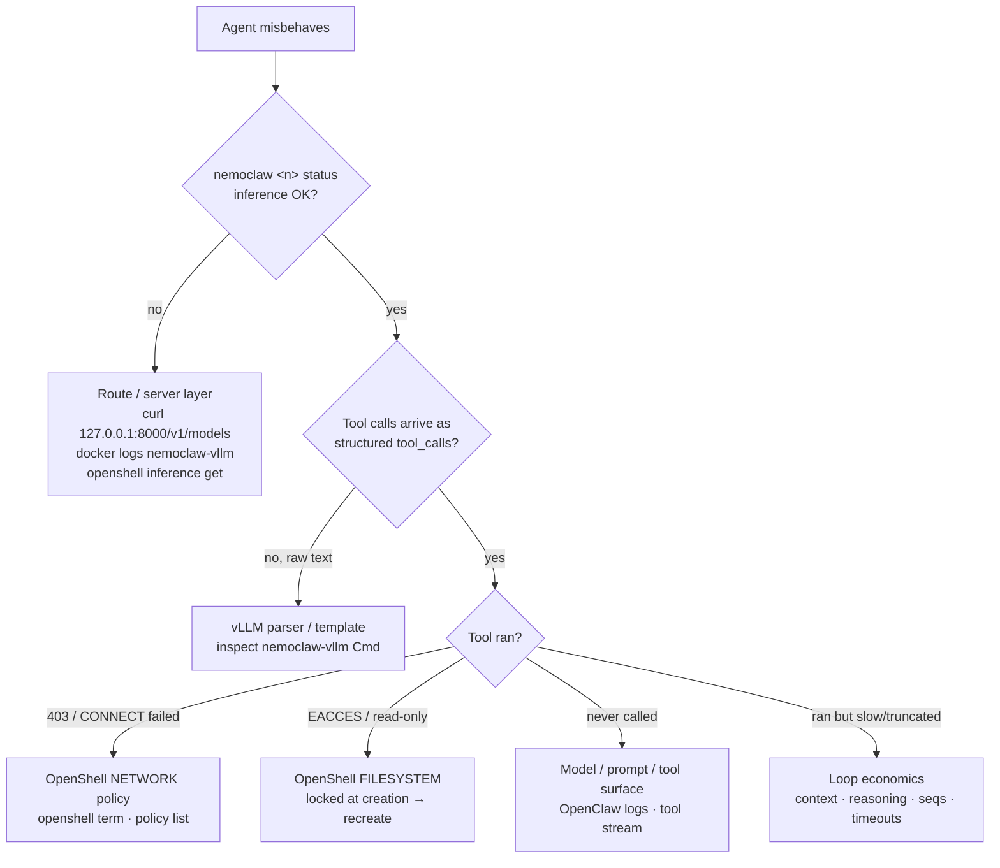

# 04 · Debugging — symptom → layer → command

*Start every investigation the same way, then split by layer. The stack has exactly four layers that can fail
(route/server · parser/template · policy · loop economics) — this page routes you to the right one fast.*

Source: `docs-raw/Agent onboarding … GB10.md` Part 3B.

## Always start here

```bash
nemoclaw <n> status
```
It probes `https://inference.local/v1/models` **from inside the sandbox** and sends a **real inference request
over the agent's own route.** If that passes, the route and server are fine — move downstream.

## Triage flowchart



## Symptom table

| Symptom | Layer | Commands / logs | Usual fix |
|---|---|---|---|
| **Tool call printed as text / malformed JSON** | vLLM parser + chat template | `docker container inspect --format '{{json .Config.Cmd}}' nemoclaw-vllm` (look for `--enable-auto-tool-choice` + the parser); replay one `curl` to `127.0.0.1:8000/v1/chat/completions` with `tools`, compare `content` vs `tool_calls` | Correct parser for the family; `--tool-strict-level function\|parameter`; **never** `/v1/responses`; `tool_choice:"required"` only as last resort |
| **Tool never called** | Model / prompt / tool surface | `nemoclaw <n> logs --follow` (tool-stream events); OpenClaw logs in sandbox; check the tool/skill is enabled | Better tool descriptions; fewer tools in the prompt; check reasoning didn't eat `max_tokens` (`finish_reason=length`) |
| **Tool blocked** | OpenShell network or filesystem | In sandbox: `CONNECT tunnel failed, 403`; host: `openshell term` (`r` Network Rules); `nemoclaw <n> policy list`; `logs --tail 50` | Approve live (`a`) for the demo; persist with `policy-add <preset>` or `openshell policy update … --add-endpoint`; **filesystem needs a recreate** |
| **Endpoint unreachable** | Route / server / firewall | `nemoclaw <n> status`; `curl 127.0.0.1:8000/v1/models`; `docker logs nemoclaw-vllm`; `openshell inference get`; `systemctl --user status openshell-gateway` | Wait for model load; restart container; allow the OpenShell Docker subnet to the gateway port (`ufw` line onboarding printed); raise `NEMOCLAW_LOCAL_INFERENCE_TIMEOUT` |
| **Loop too slow** | vLLM scheduling + loop shape | vLLM `/metrics` (TTFT, queue time) + container logs; count model calls/turn in the tool stream | Fewer, more decisive tools; thinking off for simple turns (`/think off` on Qwen); keep prefix caching on; `--max-num-seqs ≥ 2` so compaction doesn't queue; raise `models.providers.<id>.timeoutSeconds` (idle default 300s) not the global run timeout |
| **Context blowup** | OpenClaw compaction + `--max-model-len` | compaction events in the stream; vLLM context-length errors; `nemoclaw <n> status` | Truncate tool outputs (summaries, not 4,000 rows); rely on compaction; keep `--max-model-len` modest on Spark (long ctx → host OOM); NemoClaw adopts vLLM's `max_model_len` unless `NEMOCLAW_CONTEXT_WINDOW` set |
| **Sandbox not ready / onboarding stalls** | NemoClaw lifecycle | `nemoclaw host probe`; `openshell sandbox list`; `NEMOCLAW_SANDBOX_READY_TIMEOUT=600` | `nemoclaw onboard --resume`; **never `--fresh`** unless you mean to wipe |
| **Dashboard won't load** | Port forward | `nemoclaw <n> dashboard-url --quiet`; `openshell forward list` | Use **`127.0.0.1`**, not `localhost` (origin check); `openshell forward stop <port> <n>` then `… start <port> <n> --background` |

## Two traps worth pre-loading into your head

- **`localhost` ≠ `127.0.0.1`** for the dashboard — the origin check rejects `localhost`.
- **Filesystem denials can't be approved live.** If a tool hits `EACCES` / read-only outside `/sandbox`, `/tmp`,
  `/dev/null`, `/dev/pts`, the only fix is recreating the sandbox — which is why you decide file scope *before* creation.

## Host-safety reminder

Local vLLM has **no auth by default.** Firewall `:8000` so only loopback + the OpenShell Docker bridge can reach
it — on venue Wi-Fi this matters. (Oversized models/long contexts can also cause `NV_ERR_NO_MEMORY`, SSH loss, or
a host freeze — keep headroom per [02-local-inference.md](02-local-inference.md).)
